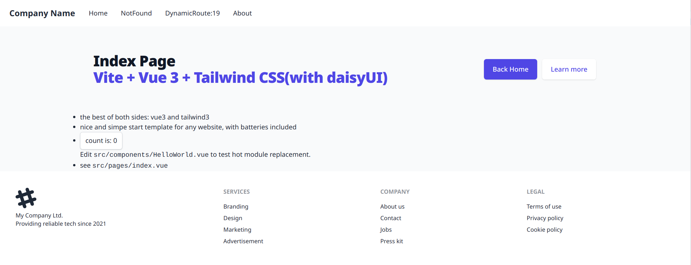

# vue3-tailwind3-website-starter

A nice and simpe website start template using awesome things related to vue3 and tailwind3.

This template is **practical** and **batteries included** but not overly complex or bloated. Also explicit configuration over magic; it should be easy to understand how everything works, strip out anything you don't need, and fast to modify things to your needs.

Includes plenty of **examples and documentation** of how to do things but **minimal cruft** to delete to get you going.

Please check out the [demo](https://vue3-tailwind3-website-starter.vercel.app/) for example. A [detailed changelog](./CHANGES.md) is available.
## Features

- Vue 3.2, Vite2, TypeScript
- [pinia](https://github.com/vuejs/pinia) store
- [Vue Router](https://github.com/vuejs/vue-router)
  - [`vite-plugin-pages`](https://github.com/hannoeru/vite-plugin-pages) - file system based routing
  - [`vite-plugin-vue-layouts`](https://github.com/JohnCampionJr/vite-plugin-vue-layouts) - layouts for pages
- [Vue I18n](https://github.com/intlify/vue-i18n-next) - Internationalization
  - [`vite-plugin-vue-i18n`](https://github.com/intlify/vite-plugin-vue-i18n) - Vite plugin for Vue I18n
- [`unplugin-vue-components`](https://github.com/antfu/unplugin-vue-components) - components auto import

- Tailwind CSS 3.0 w/ following plugins preinstalled:
  - `@tailwindcss/aspect-ratio`
  - `@tailwindcss/line-clamp`
  - `@tailwindcss/typography`
  - `@tailwindcss/forms`
  - `firefox`-variant
  - `daisyui`
- PostCSS 8 w/ `postcss-nesting` plugin and `cssnano` for minimizing production CSS
- Eslint
- Prettier
- Alias `@` to `<project_root>/src`
- Manually configured global components in `main.ts`
- Predefined and fully typed global variables:
  - `VITE_APP_VERSION` is read from `package.json` version at build time
  - `VITE_APP_BUILD_EPOCH` is populated as `new Date().getTime()` at build time
- Using newest `script setup` syntax w/ Ref sugar (see the official [Script Setup documentation](https://vuejs.org/api/sfc-script-setup.html) and [Ref Sugar RFC](https://github.com/vuejs/rfcs/discussions/369) discussion)
- Cypress.io e2e tests (configured similarly to `vue-cli`)
- Cypress.io component tests
- GitHub workflows
  - Dependabot
  - Automated e2e tests
  - Automated component tests
- GitLab CI
  - Automated e2e tests
  - Automated component tests

## Thanks

- [vitesse](https://github.com/antfu/vitesse)
- [vite-ts-tailwind-starter](https://github.com/Uninen/vite-ts-tailwind-starter)